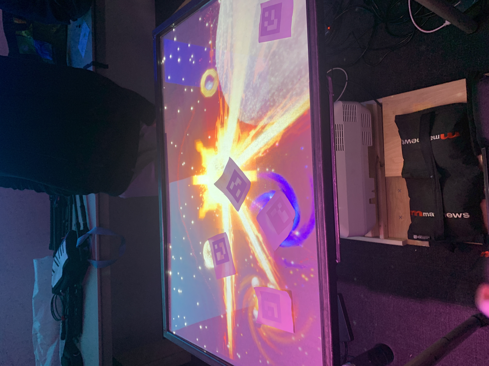
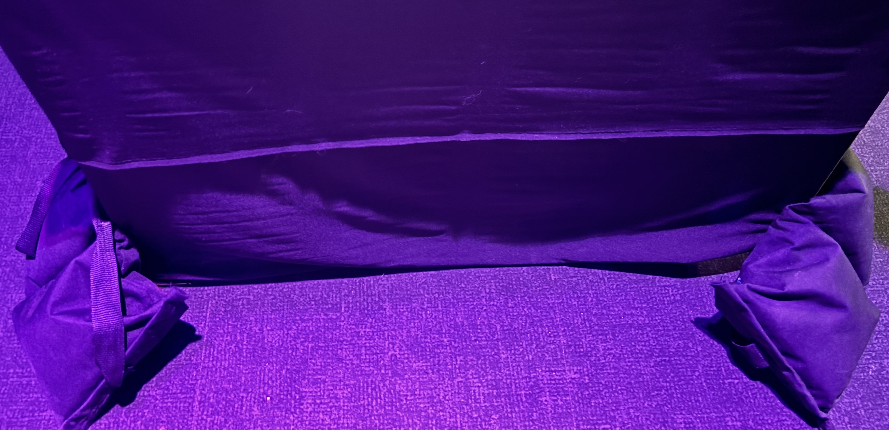
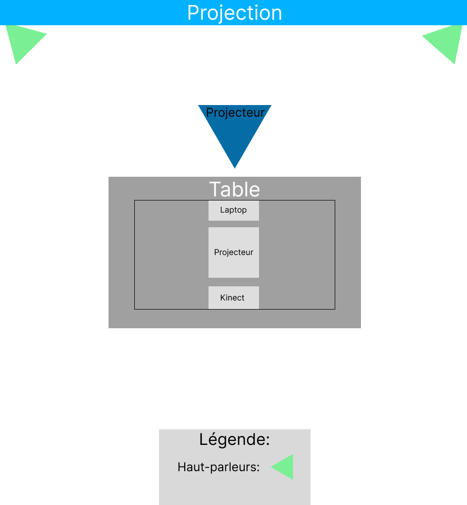
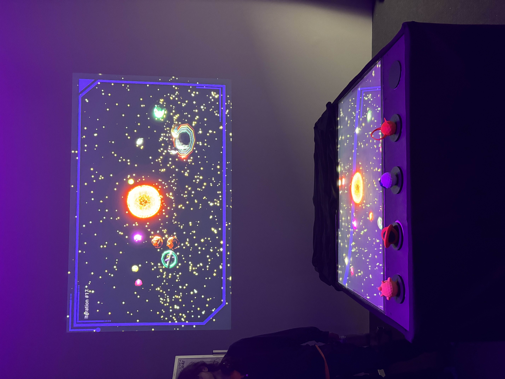

# Canevas Cosmique

image

## Type d'exposition
temporaire et intérieur

## Mardi 20 Février 2024

### Canevas Cosmique

image complete de l'oeuvre

## Description 
Canevas Cosmique à été réaliser en 2024
Pour la réalisation de ce projet il y à plusieurs créateurs :
- [ ] Jacob Alarie-Brousseau
- [ ] Étienne Charron
- [ ] Jérémy Cholette
- [ ] Quoc Huy Do
- [ ] Mikaël Tourangeau

Canevas cosmique est constituer d'une table où pars dessus celle-ci ce trouve plusieurs statues 3d. Lorsque celles-ci intéragis avec ce qui est projecter sur la table, elles créent des météores, des trous noires et plus. Nous pouvons voir ce qui se passe sur la table, mais aussi projecter sur un mur juste devant la table.

## Éléments nécessaires à la mise en exposition
- [ ] Haut-parleur
- [ ] fils pour son
- [ ] projecteur
- [ ] Kinect
- [ ] Cables
- [ ] Ordinateur/laptop
- [ ] sac de sable

  

## Mise en espace 

  

## Expérience vécue
Lors de l'exposition 

Description de l'oeuvre ou du dispositif + image et video
Mise en espace + photo piece et croquis
Composantes et techniques
Éléments nécessaires à la mise en exposition
Expérience vécue
