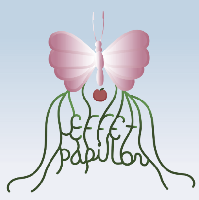
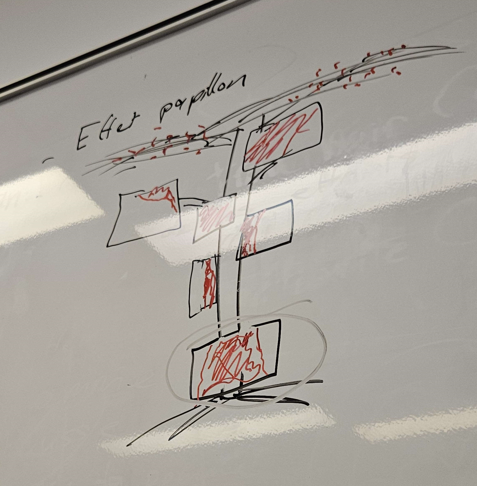
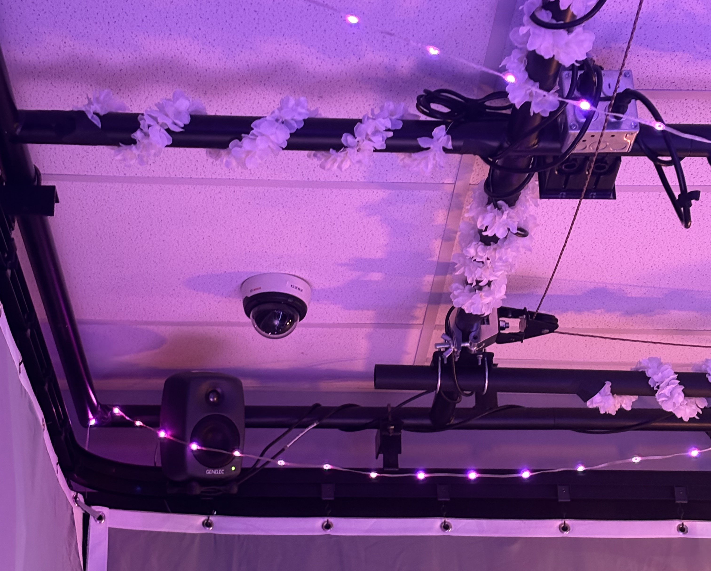
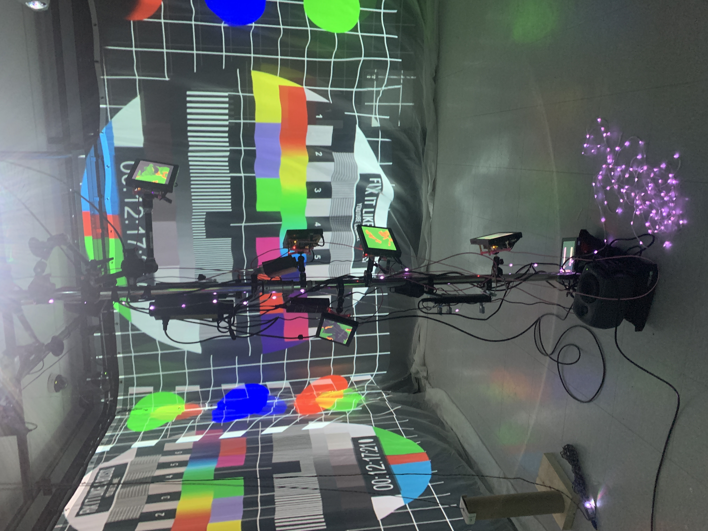
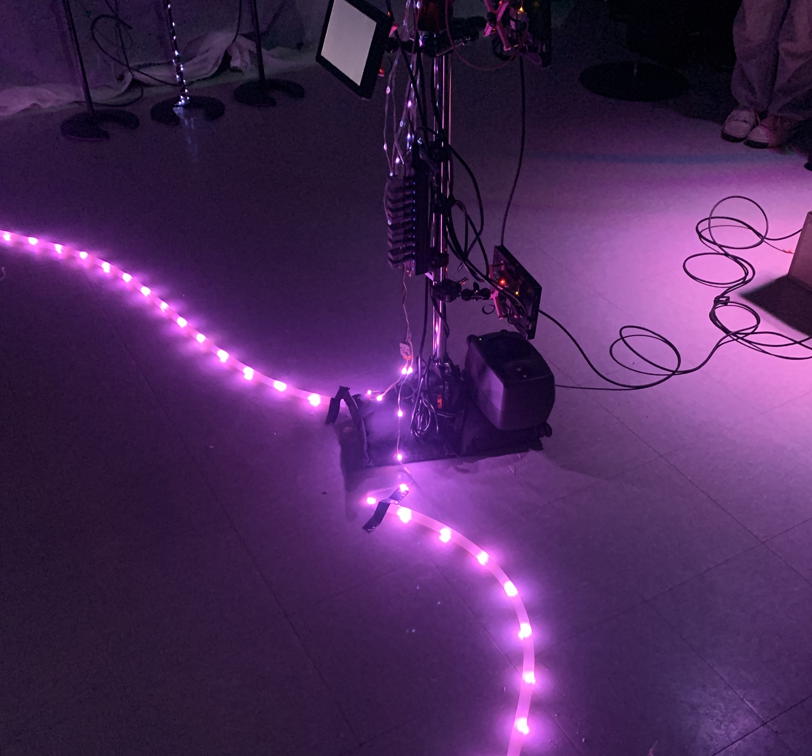

# Effet Papillon

# RÉALISATEURS
- [ ] Raphaël Dumont
- [ ] Alexis Bolduc
- [ ] William Morel
- [ ] (Ryan) Alexia Papanikolaou
- [ ] Viktor Zhuravlev
- [ ] Jasmine Lapierre

## LIEN AVEC LE THÈME CRESCENTIA
Le lien entre l'exposition "Effet Papillon" et le thème "Crescentia" est la croissance. "Crescentia" signifie « croissance » en latin, et l'exposition la met en valeur tout au long de son déroulement. En résumé, le déroulement de l'exposition "Effet Papillon" illustre le cycle de vie d'un pommier, où nous pouvons observer la croissance de la graine jusqu'au développement du pommier mature.

## SCHÉMA DE L'INSTALLATION

## INSTALLATION

 
 

## RESSENTIT
Lors de ma participation à cette installation, je crois que je serai très attentive, car les actions que j'entreprendrai auront un impact sur le déroulement de l'expérience. Ayant peu de connaissances sur le cycle de vie d'un pommier, je suis déterminée à en apprendre davantage à travers cette expérience.
