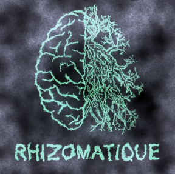
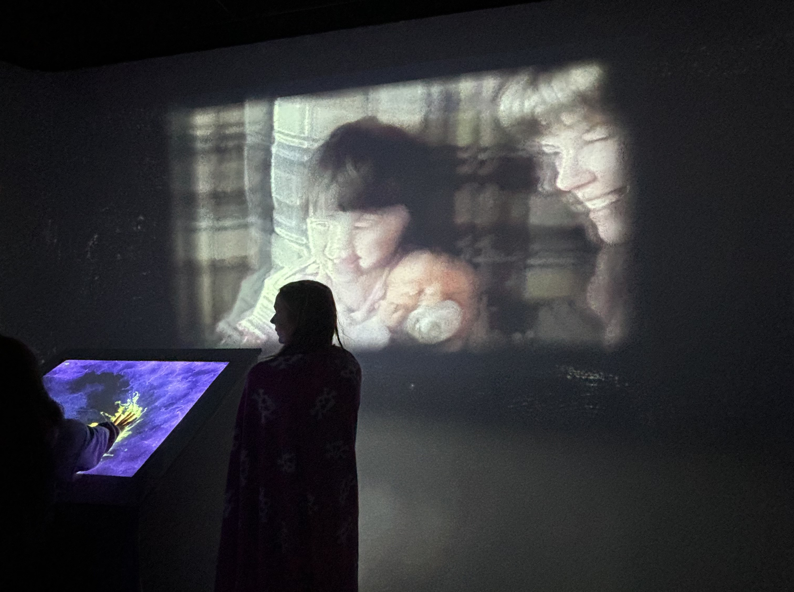
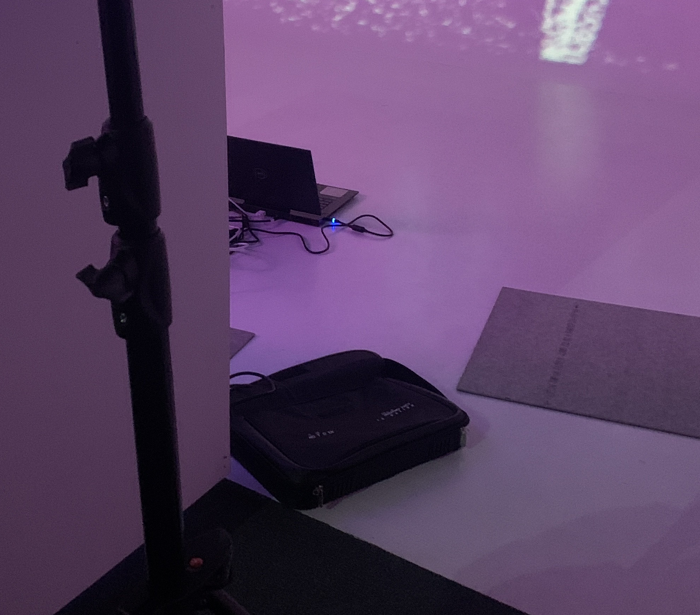
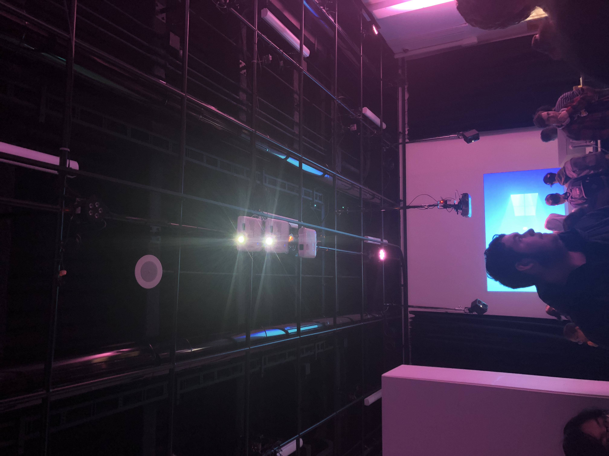
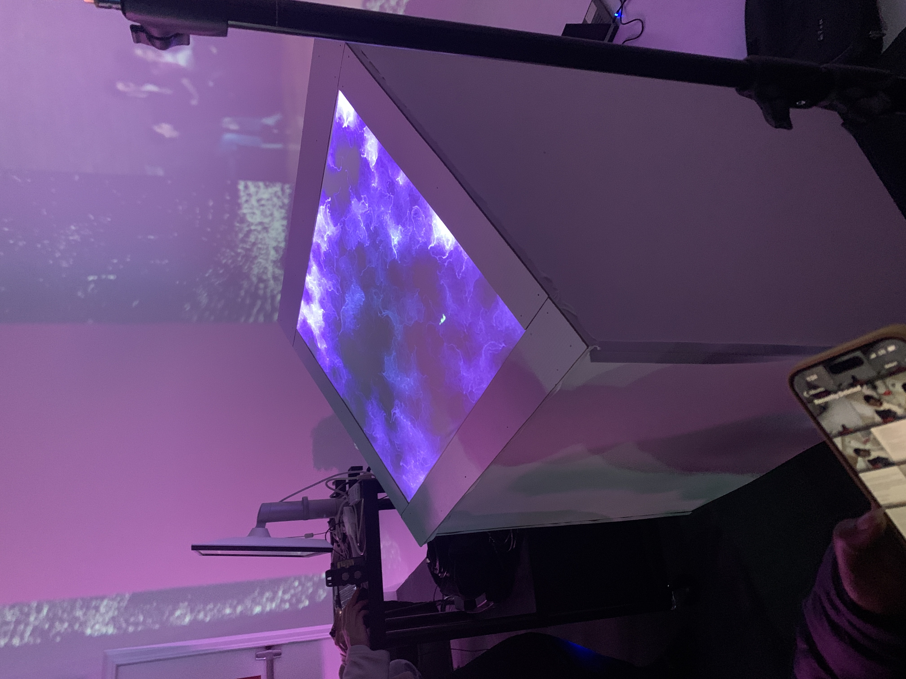

# Rhizomatique

# RÉALISATEURS
- [ ] Jolyanne Desjardins
- [ ] MaÏka Désy
- [ ] Laurie Houde
- [ ] Felix Testa Radovanovic

## LIEN AVEC LE THÈME CRESCENTIA
Le lien entre l'exposition "Rhizomatique" et le thème "Crescentia" est la croissance. Rhizomatique est les faits que les souvenirs qui apparaissent sur l'écran lorsque la toile et toucher nous ramènent dans le passé et montre tous les souvenirs de quelqu'un et ces souvenirs avancent dans le futur le plus que nous interagissons avec la toile.

## SCHÉMA DE L'INSTALLATION

## INSTALLATION

## RESSENTIT
Lors de cette exposition je crois que je vais être vraiment surprise, car je n'ai jamais vu d'exposition de cette sorte où il y a une toile qui peut détecter nos mains qui rentrent en contact avec celle-ci.

3.l'installation en cours dans les studios pour chacun des projets (photos à l'appui)
5.le schéma de l'installation prévue (insérer le schéma de plantation de chacun des projets, avec la source)
