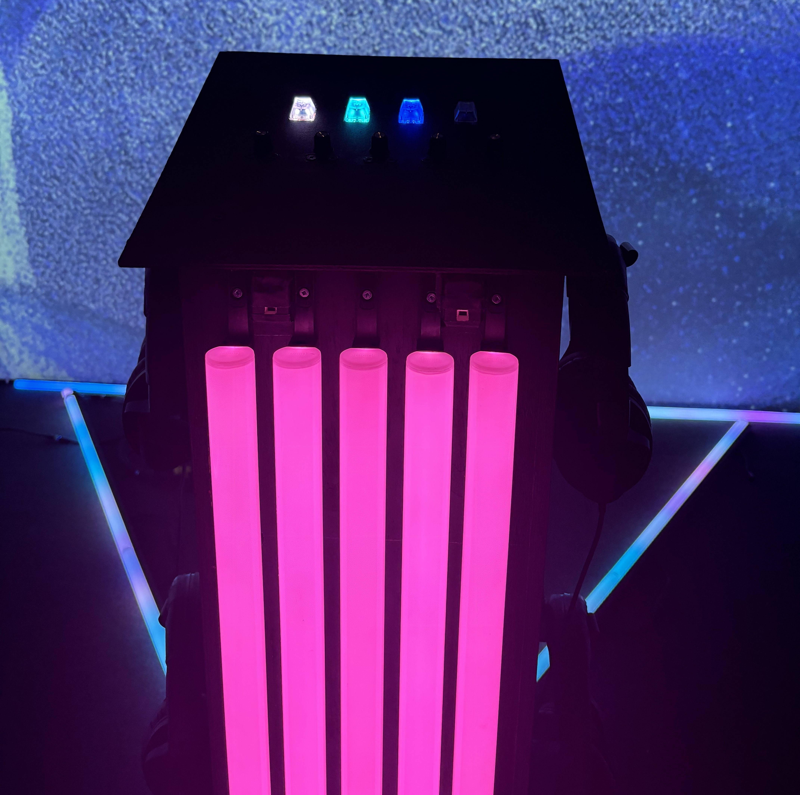

# Sonalux

# RÉALISATEURS

- [ ] Antoine Haddad
- [ ] Camélie Laprise
- [ ] Ghita Alaoui
- [ ] Vincent Desjardins 

## LIEN AVEC LE THÈME CRESCENTIA
Le lien entre l'exposition "Solanux" et le thème "Crescentia" est la croissance. Lorsque interagit avec, l'installation nous envoie dans un voyage astral où le plus nous interagissons avec, plus les images projetées bougent et plus le son changé.

## SCHÉMA DE L'INSTALLATION

## INSTALLATION
    

## RESSENTIT
Lors de cette exposition je crois que je vais être attentive, car il y a de la musique relier à cette exposition ce qui est une importante partie de celle-ci.
