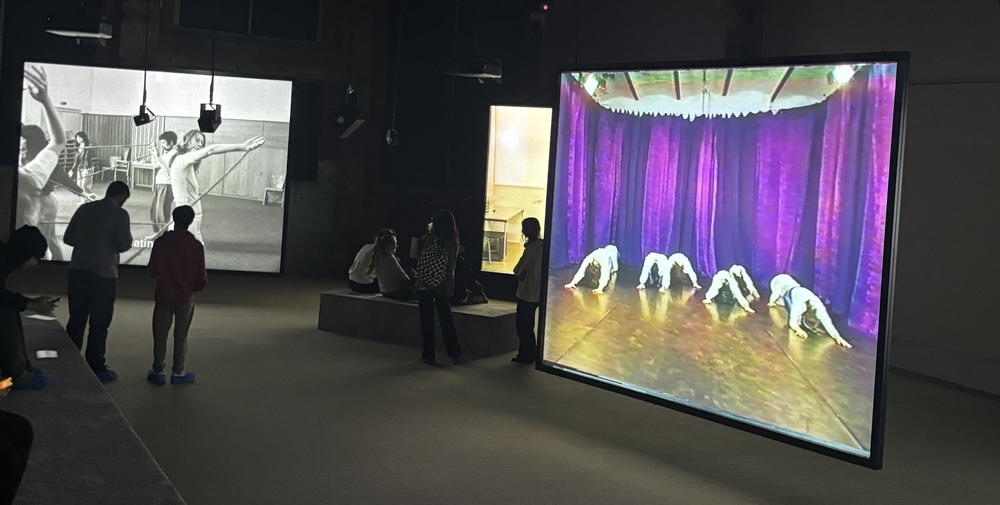
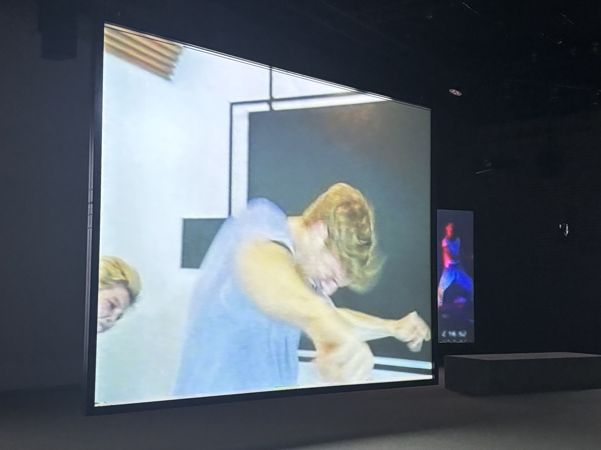
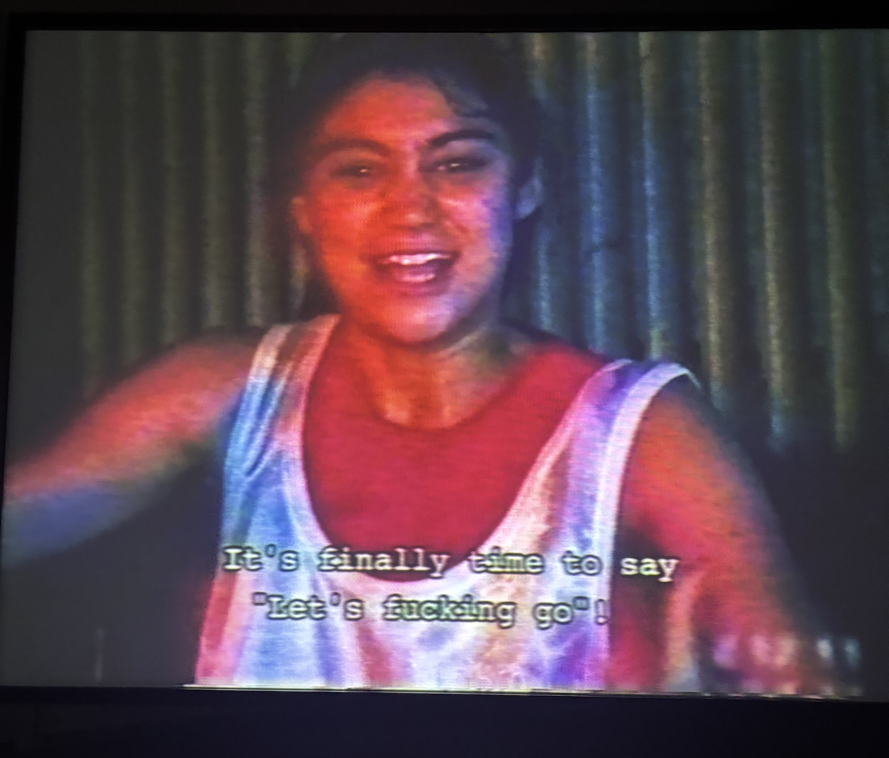
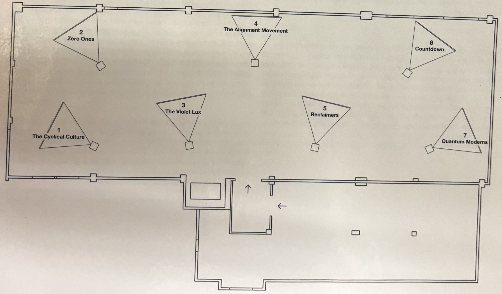
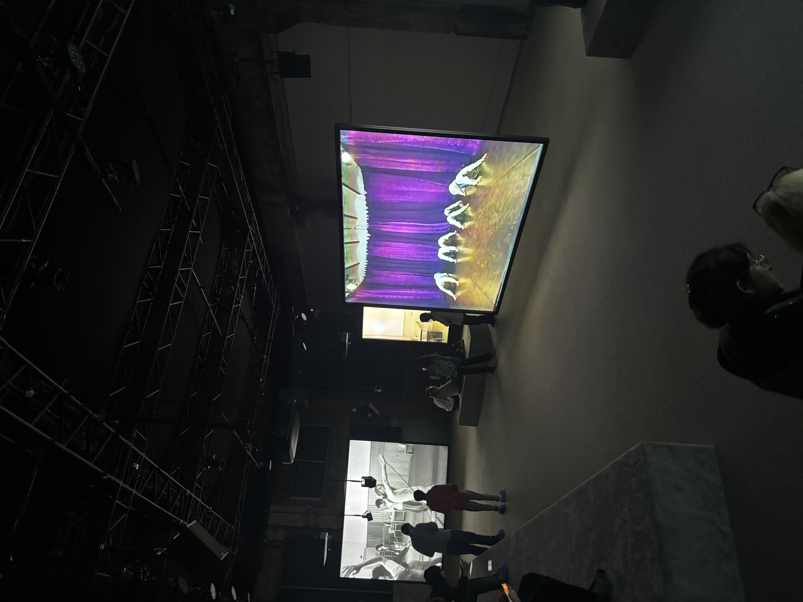
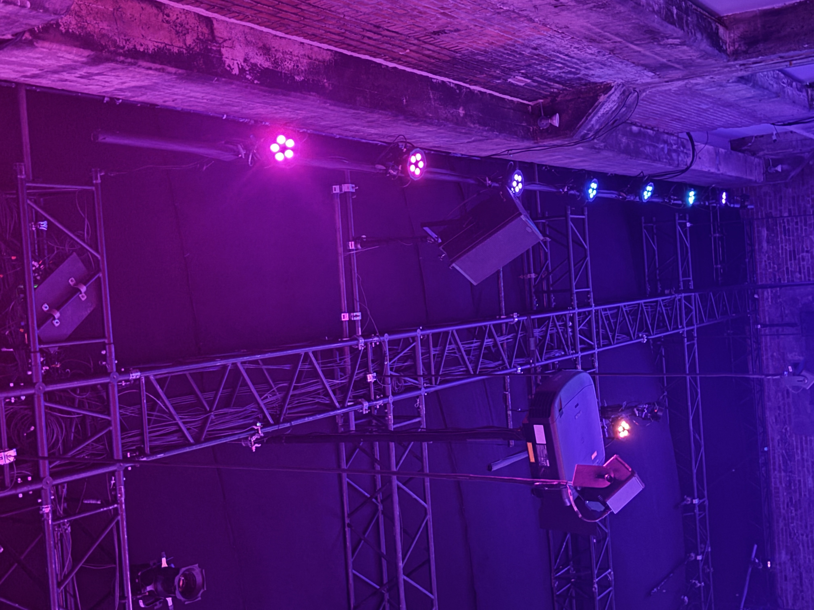

# Phase shifting index

## Détails exposition

Le nom de l'exposition est Phase shifting index fait et se retrouve à la Fonderie Darling, visité le 2 février 2024. Cette exposition est de type temporaire et intérieure.

> Photo de l'affice d'exposition.

> Photo de la vue complète de l'oeuve.

> Photo de moi devant l'entré de la Fonderie Darling.

## Oeuvre

Dans la salle de l'exposition, il se trouve 7 écrans qui comportent tous des vidéos différentes et des projecteurs qui diffusent les vidéos. Lorsque les vidéos sont diffuséent, le son de celles-ci sort des haut-parleurs au-dessus et sur les deux côtés des écrans.

> Image du Cartel.

> Vue des écrans 1, 2 et 3.

> Vue de l'écran 4.

> Vue de l'écran 5.

> Vue de l'écran 6.

## Mise en espace

Les écrans son placéent du manière que si tu te retrouve devant la pièce et au milieu, vous pouvez voir tous les écrans.

> Croquis de la piece.

## Éléments nécessaires à la mise en exposition

Les élements nécessaires à la mise en exposition sont

- [ ] Les écrans
- [ ] Les projecteurs
- [ ] Les haut-parleurs
- [ ] Les lumières
- [ ] Les cables

> Les Élements.

> Les Élements.

## Expérience vécue
J'ai trouvé l'expérience plutôt bizarre, car je ne suis pas habituer à voir des expositions d'arts. Je trouve que c'est plutôt créatif comment il a pu nous tromper et faire comme si les vidéo sont été prisent dans différentes années.

## Aspect plu et non plu

Ce qui ma plu est que c'était vraiment immersif d'une façons que je me sentait bizarre et que le son t'englobe. Les vidéos donnait des ambiances étranges. Ce qui ne ma pas plus est le fait que c'est quand même long. 
