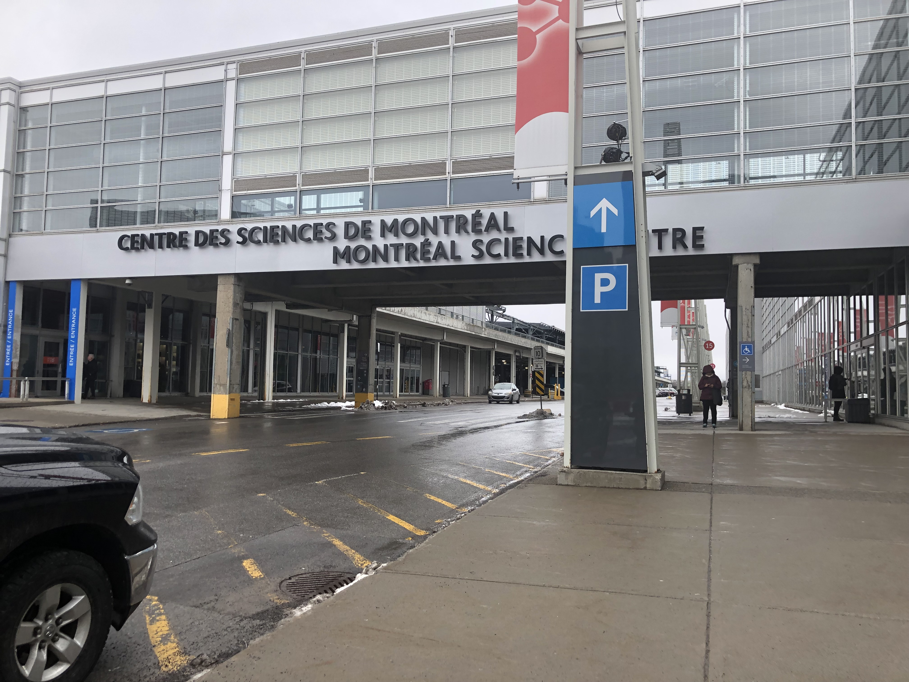
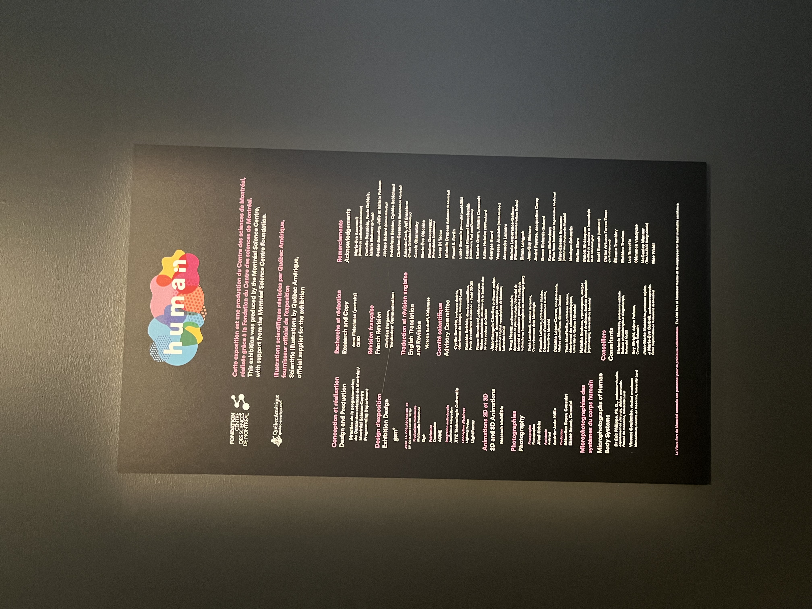
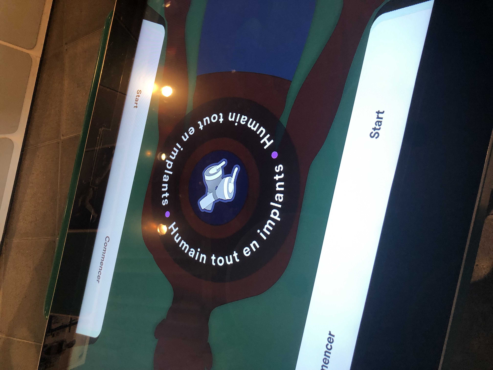
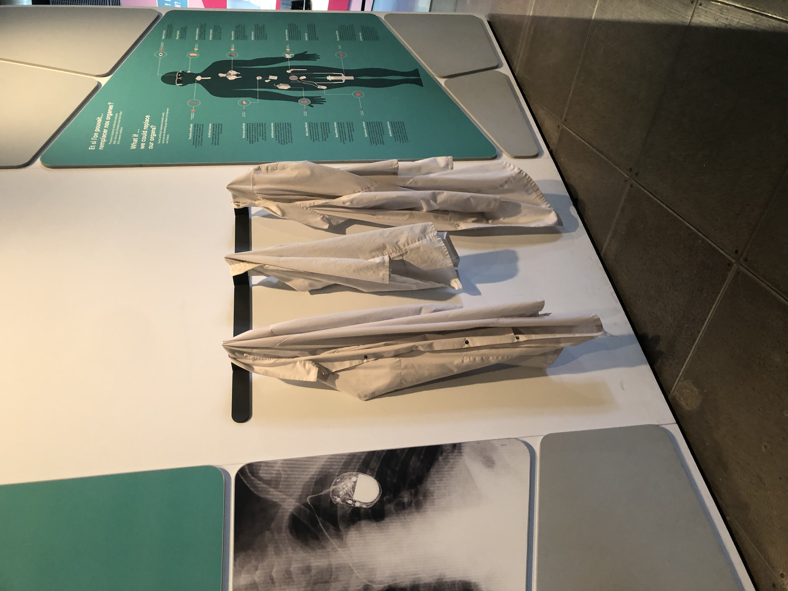
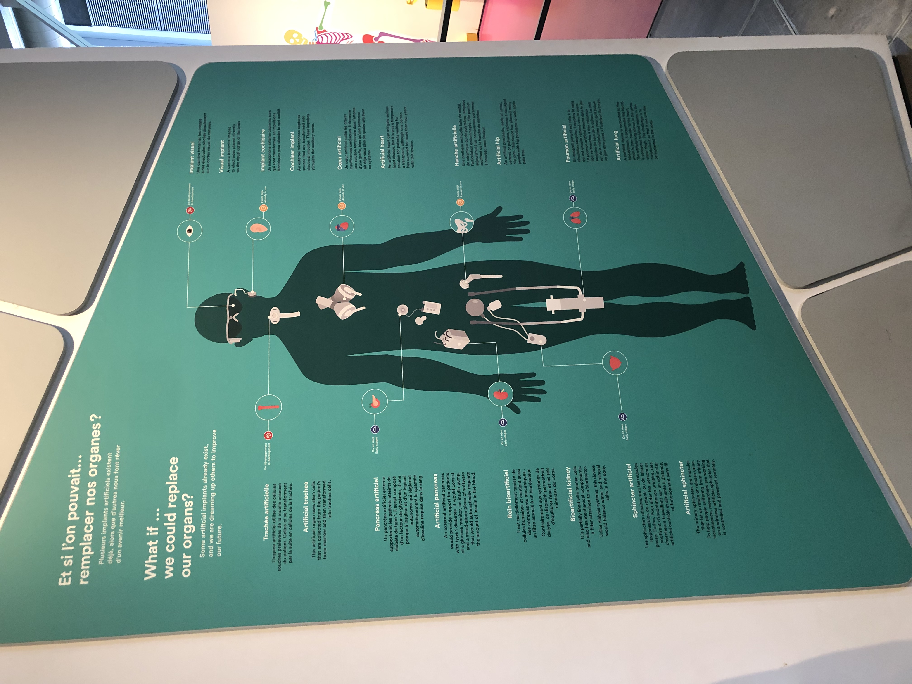

# Centre des sciences

## Vendredi 5 avril 2024

## Créateurs
 

# Installation
Mon installation était dans la section humaine du centre des sciences. Mon installation parlait de ce que nous pouvons changer dans le corps humain qui n'est pas supposé se retrouver à l'intérieur de celui-ci. Nous pouvons interagir avec en touchant la vitre. Les visiteurs peuvent prendre des sarraus pour rendre l'expérience plus amusante. Les visiteurs peut se renseigner sur comment jouer sur le mur à côté de la table.
    

## Ressentit et plus/ pas plus
J'ai choisi cette installation, car je l'ai trouver le plus intéressant et amusant. Une chose que j'aurais changé est la sensibiliser de la vitre, c'était difficile de faire des mouvements, car elle ne détectait pas bien mes doigts.

