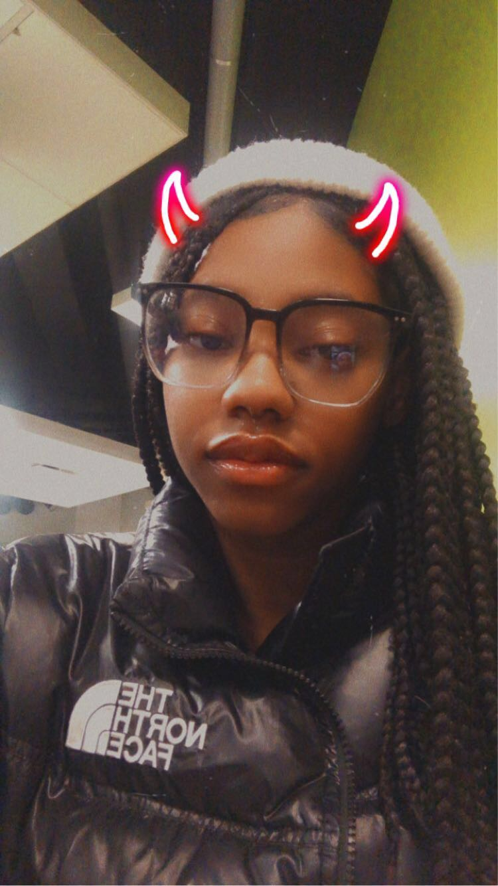

# Sarah Muller François

Photo de moi dans la cafétaria de montmorency.

## **Intérêts dans le multimédia**
Lorsque j'ai appris sur l'intégration en multimédia je ne savais pas c'était quoi, mais lorsque j'ai regarder dans le guide de sur tout les programmes dans le cégep, j'ai trouver l'intégration multimédia vraiment intéressant, car il était écrit qu'il y allait avoir de l'animaion 2D et de l'animation 3D et ce sont des  choses qui m'intéresse vraiment. Je n'est pas d'expérience dans les 2, donc j'espère aimer ce que nous allons faire dans les 2 cours.

<https://youtu.be/_awS3u-V_nE?si=hdjkoHwsb7xTn_EV>
